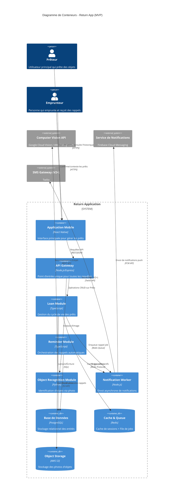
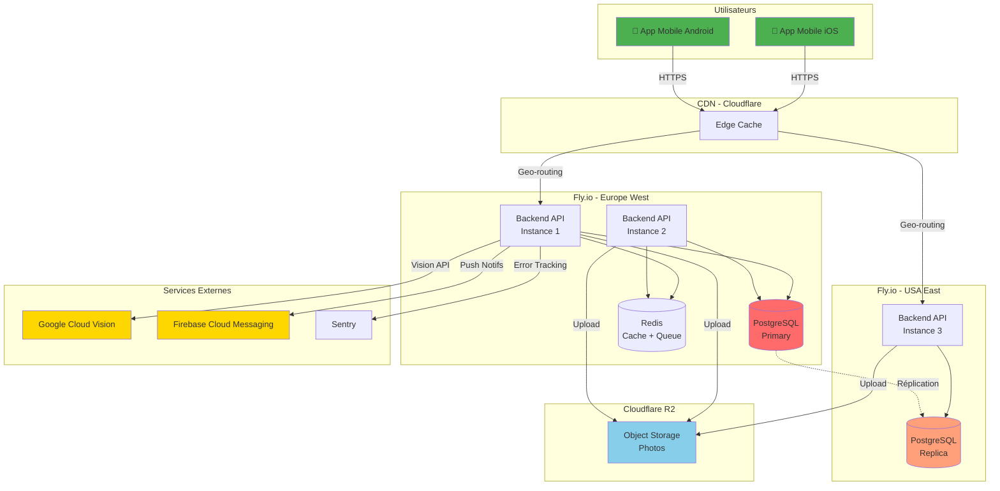

# 01_ARCHITECTURE_TECHNIQUE.md

**Return ↺ - Spécifications Techniques & Décisions d'Architecture**

---

## 1. Architecture de Haut Niveau (High-Level Design)

### Pattern d'Architecture Choisi : **Monolithe Modulaire**

#### Justification Stratégique

Pour un MVP mobile-first avec des exigences de rapidité de développement et une équipe réduite, un monolithe modulaire
est le choix optimal. Voici pourquoi :

**✅ Alignement avec la Vision :**

- **Time-to-market** : Le KPI "Taux d'activation à 48h" nécessite un déploiement rapide. Un monolithe permet des
  itérations plus rapides qu'une architecture distribuée.
- **Simplicité opérationnelle** : Un seul déploiement, un seul point de monitoring. Cohérent avec le positionnement "
  outil utilitaire simple".
- **Cohérence des transactions** : Les prêts impliquent plusieurs entités (Objet, Emprunteur, Rappels). Un monolithe
  évite les problèmes de cohérence distribuée.

**✅ Modularité Préservée :**

- Organisation en modules métier (Loans, Items, Reminders, Users) permettant une future extraction en microservices si
  nécessaire.
- Isolation des dépendances : chaque module a ses propres interfaces et contrats.

**❌ Microservices rejetés :**

- Over-engineering pour un MVP avec < 10 000 utilisateurs prévus en V1
- Complexité réseau et latence inutiles pour des opérations CRUD simples
- Coût d'infrastructure et de monitoring multiplié

**❌ Serverless rejeté :**

- Cold starts incompatibles avec l'expérience "Scan & Go < 30s"
- Coût imprévisible avec la reconnaissance d'image (appels tiers)
- Moins de contrôle sur les timeouts de notification

### Diagramme C4 - Niveau Conteneur



-----Contre Expertise--------

Le diagramme C4 présente deux incohérences avec le reste de la documentation :

1. **"Object Recognition Module" en Python** : Nulle part ailleurs il n'est question d'un service Python séparé. La
   roadmap backend (Sprint 3) traite l'OCR comme un simple appel à Google Cloud Vision depuis un `GoogleVisionService`
   NestJS. Si c'est juste un wrapper d'appel API, un service NestJS suffit — pas besoin d'un conteneur Python distinct.
   Le diagramme doit être aligné avec la réalité de l'implémentation.

2. **"API Gateway (Node.js/Express)" comme conteneur distinct** : L'architecture choisie est un monolithe modulaire
   NestJS. Il n'y a pas d'API Gateway séparé — NestJS fait office de point d'entrée unique. Le diagramme donne
   l'impression d'une architecture microservices, ce qui est trompeur pour un lecteur extérieur.

---

## 2. Stack Technique Détaillée

### 2.1 Frontend

| Composant          | Technologie                    | Version | Justification                                                                                           |
|--------------------|--------------------------------|---------|---------------------------------------------------------------------------------------------------------|
| **Framework**      | **React Native**               | 0.73+   | Cross-platform (iOS/Android) avec une seule codebase. Écosystème mature, performance native via Hermes. |
| **Gestion d'état** | **Zustand**                    | 4.x     | Plus léger que Redux, API simple. Suffisant pour un MVP sans logique métier complexe côté client.       |
| **Navigation**     | **React Navigation**           | 6.x     | Standard de facto pour React Native. Support du deep linking (partage de prêts).                        |
| **UI Library**     | **React Native Paper**         | 5.x     | Material Design 3 out-of-the-box. Cohérent avec l'UX "simple et utilitaire".                            |
| **Formulaires**    | **React Hook Form**            | 7.x     | Performance optimale, validation native. Crucial pour le formulaire de création de prêt.                |
| **Caméra**         | **react-native-vision-camera** | 3.x     | Performance supérieure à react-native-camera. Support du ML Kit pour pré-traitement local.              |
| **Notifications**  | **@notifee/react-native**      | 7.x     | Gestion avancée des notifications locales et push. Support des actions directes (confirmer/refuser).    |

-----Contre Expertise--------

React Native 0.73+ et React Navigation 6.x sont des versions déjà datées. Au moment du développement (février 2026),
React Native sera probablement en 0.77+ et React Navigation en 7.x. Les versions listées devraient être présentées comme
minimales ou mises à jour pour refléter l'état actuel de l'écosystème.

### 2.2 Backend

| Composant            | Technologie     | Version | Justification                                                                                                     |
|----------------------|-----------------|---------|-------------------------------------------------------------------------------------------------------------------|
| **Langage**          | **TypeScript**  | 5.3+    | Type safety, refactoring sécurisé. Partage des types avec le frontend.                                            |
| **Runtime**          | **Node.js**     | 20 LTS  | Écosystème mature, excellentes performances I/O. Cohérent avec React Native (même langage full-stack).            |
| **Framework**        | **NestJS**      | 10.x    | Architecture modulaire native (alignée avec notre choix monolithe modulaire). DDD-friendly. Dependency injection. |
| **ORM**              | **Prisma**      | 5.x     | Type-safe, migrations automatiques. Génération de clients TypeScript. Meilleure DX qu'un ORM classique.           |
| **Validation**       | **Zod**         | 3.x     | Validation runtime + génération de types TS. Réutilisable frontend/backend.                                       |
| **Authentification** | **Passport.js** | 0.7+    | Stratégies modulaires (JWT pour V1, OAuth pour V2+).                                                              |
| **File de Jobs**     | **BullMQ**      | 5.x     | File de jobs robuste basée sur Redis. Gestion des rappels différés et retry.                                      |
| **Logging**          | **Winston**     | 3.x     | Logs structurés JSON. Intégration avec services de monitoring (Datadog, Sentry).                                  |

-----Contre Expertise--------

**Prisma + Repository Pattern : friction architecturale.** Le document impose le Repository Pattern (DIP) pour ne jamais
dépendre de Prisma dans les services. Mais Prisma génère déjà des types TypeScript fortement typés et un client
query-builder. Encapsuler Prisma derrière un Repository avec des mappers `toDomain`/`toPersistence` ajoute une couche de
boilerplate significative pour un MVP. La probabilité de changer d'ORM à court terme est quasi nulle. Est-ce que cette
abstraction vaut le coût en V1 ?

**Zod vs class-validator : choix non tranché.** Le doc liste Zod 3.x pour la validation, mais NestJS s'intègre
nativement avec `class-validator` et `class-transformer` via les DTOs et les Pipes. Utiliser Zod à la place nécessite
une intégration custom. Le choix Zod se justifie si on veut partager les schémas de validation frontend/backend, mais ce
point n'est jamais explicité. Il faut trancher : Zod ou class-validator ?

### 2.3 Base de Données

| Composant                  | Technologie                    | Version | Justification                                                                                                                                        |
|----------------------------|--------------------------------|---------|------------------------------------------------------------------------------------------------------------------------------------------------------|
| **Base Principale**        | **PostgreSQL**                 | 16+     | Relations complexes (Prêts-Objets-Emprunteurs). Support des transactions ACID crucial pour le statut des prêts. Extension pgcrypto pour chiffrement. |
| **Cache**                  | **Redis**                      | 7.x     | Cache de sessions, file de jobs (BullMQ), rate limiting. Stockage des tokens de notification FCM.                                                    |
| **Object Storage**         | **AWS S3** / **Cloudflare R2** | -       | Stockage des photos d'objets. R2 sans frais d'egress (optimisation coûts).                                                                           |
| **Full-Text Search (V2+)** | **PostgreSQL tsvector**        | -       | Recherche d'objets par nom/description. Suffisant pour MVP avant Elasticsearch.                                                                      |

### 2.4 Infrastructure

| Composant               | Technologie                                       | Justification                                                                         |
|-------------------------|---------------------------------------------------|---------------------------------------------------------------------------------------|
| **Hébergement Backend** | **Fly.io** / **Railway**                          | Déploiement global (edge locations), pricing MVP-friendly. PostgreSQL managed inclus. |
| **Hébergement Storage** | **Cloudflare R2**                                 | Zéro frais d'egress. S3-compatible.                                                   |
| **CI/CD**               | **GitHub Actions**                                | Intégration native GitHub. Workflows YAML simples. Coût gratuit pour repos publics.   |
| **Containerisation**    | **Docker**                                        | Image backend unique. Facilite déploiement et reproductibilité.                       |
| **Monitoring**          | **Sentry** (Erreurs) + **Fly.io Metrics** (Infra) | Sentry gratuit jusqu'à 5k events/mois. Suffisant pour MVP.                            |
| **CDN**                 | **Cloudflare**                                    | Cache des assets statiques. Protection DDoS gratuite.                                 |

### 2.5 Services Tiers

| Service                | Provider                           | Usage                                                            |
|------------------------|------------------------------------|------------------------------------------------------------------|
| **Computer Vision**    | **Google Cloud Vision API**        | Reconnaissance d'objets via photo. 1000 requêtes/mois gratuites. |
| **Notifications Push** | **Firebase Cloud Messaging (FCM)** | Notifications iOS + Android. Gratuit, illimité.                  |
| **Emails (V2+)**       | **Resend** / **SendGrid**          | Rappels par email. Resend = 3000 emails/mois gratuits.           |
| **SMS (V2+)**          | **Twilio**                         | Rappels SMS pour utilisateurs sans l'app. Pay-as-you-go.         |
| **Analytics**          | **PostHog** (self-hosted)          | Analytics privacy-first. Alternative à Google Analytics.         |

---

## 3. Architecture Decision Records (ADR)

### ADR-001 : Choix de PostgreSQL plutôt que MongoDB

**Contexte :**  
Les prêts impliquent des relations strictes entre Objets, Emprunteurs et Rappels. Le statut d'un prêt change via des
transitions d'état complexes (workflow de confirmation). Les requêtes principales sont des jointures (ex: "Tous les
prêts actifs de l'emprunteur X avec leurs objets").

**Décision :**  
Utiliser **PostgreSQL** comme base de données principale.

**Conséquences :**

✅ **Avantages :**

- **Intégrité référentielle** : Clés étrangères garantissent qu'un Prêt ne peut exister sans Objet ni Emprunteur.
- **Transactions ACID** : Critique pour les changements de statut (ex: passage de "En attente" à "Actif" + création du
  premier rappel doit être atomique).
- **Requêtes complexes** : Les jointures SQL sont plus performantes et lisibles que les aggregations MongoDB pour nos
  cas d'usage.
- **Extension riche** : pgcrypto pour chiffrement, pg_cron pour jobs planifiés (fallback si Redis échoue).
- **Maturité** : Plus de 30 ans d'existence, documentation exhaustive, support commercial disponible.

❌ **Inconvénients acceptés :**

- **Schéma rigide** : Les migrations nécessitent du downtime (mitigé par Prisma qui génère des migrations
  zero-downtime).
- **Scalabilité horizontale limitée** : Sharding complexe vs MongoDB. Acceptable pour < 1M d'utilisateurs (horizon 2-3
  ans).
- **Pas de nested documents** : Stocker les métadonnées d'objets (ex: historique de photos) nécessite une table séparée.
  MongoDB permettrait d'imbriquer dans le document principal.

**Dette Technique Assumée :**
Si le volume dépasse 10M de prêts actifs, envisager un passage à Postgres + Citus (sharding) ou migration partielle vers
une base NoSQL pour l'historique.

-----Contre Expertise--------

La dette technique mentionne "10M de prêts actifs". Pour une app de prêts personnels entre amis, ce scénario est
extrêmement improbable (ça représenterait des millions d'utilisateurs). Ce n'est pas un problème en soi, mais la dette
technique devrait se concentrer sur des seuils réalistes (ex: 100k prêts actifs, gestion de la croissance des photos en
R2, etc.) plutôt que sur des scénarios théoriques qui ne seront jamais atteints.

---

### ADR-002 : Choix de React Native plutôt que Native (Swift/Kotlin)

**Contexte :**  
Le KPI "Time-to-market" est critique. L'équipe doit délivrer une app iOS + Android fonctionnelle en < 3 mois.
L'expérience utilisateur doit être fluide (caméra, notifications en temps réel).

**Décision :**  
Développer avec **React Native** plutôt que des apps natives séparées.

**Conséquences :**

✅ **Avantages :**

- **Codebase unique** : Une équipe, un langage (TypeScript), maintenance divisée par 2.
- **Écosystème mature** : Librairies pour caméra (vision-camera), notifications (@notifee), navigation (
  react-navigation).
- **Hot Reload** : Itérations UX ultra-rapides. Crucial pour tester le flux "Scan & Go < 30s".
- **Compétences réutilisables** : Les développeurs React peuvent contribuer au mobile.
- **Performance acceptable** : Hermes Engine + architecture Fabric = performance proche du natif pour une app CRUD.

❌ **Inconvénients acceptés :**

- **Performance caméra** : Légèrement inférieure au natif pur. Mitigé par react-native-vision-camera qui utilise des
  wrappers natifs optimisés.
- **Taille de l'app** : ~15-20 MB de plus qu'une app native (bundle JS + bridge). Acceptable avec une connexion moderne.
- **Dépendance aux mainteneurs** : Si une lib est abandonnée (ex: react-native-camera), migration forcée. Risque mitigé
  en choisissant des libs sponsorisées (Margelo pour vision-camera).
- **Limitations OS** : Certaines APIs iOS/Android récentes nécessitent des native modules custom. Exemple : iOS Live
  Activities (V2+).

**Dette Technique Assumée :**  
Si des fonctionnalités ultra-performantes sont nécessaires (ex: AR pour visualiser l'objet dans l'espace), développer
des modules natifs ou migrer des écrans critiques en Swift/Kotlin.

---

### ADR-003 : Choix de NestJS plutôt que Express.js brut

**Contexte :**  
Le backend doit être structuré en modules métier (Loans, Reminders, Users). L'architecture DDD impose des boundaries
claires entre contextes. L'équipe doit pouvoir onboarder rapidement de nouveaux développeurs.

**Décision :**  
Utiliser **NestJS** comme framework backend plutôt qu'Express.js brut.

**Conséquences :**

✅ **Avantages :**

- **Architecture opinionée** : NestJS impose une structure modulaire (controllers, services, repositories). Aligné avec
  notre monolithe modulaire.
- **Dependency Injection native** : Facilite les tests (mocking) et respecte les principes SOLID.
- **TypeScript first-class** : Décorateurs pour validation (class-validator), OpenAPI auto-généré (Swagger), DTOs typés.
- **Écosystème intégré** : Auth (Passport), Queues (Bull), GraphQL, WebSockets out-of-the-box. Moins de temps perdu en
  configuration.
- **Documentation exhaustive** : Onboarding facilité pour nouveaux devs.

❌ **Inconvénients acceptés :**

- **Courbe d'apprentissage** : Plus complexe qu'Express pour les débutants. Nécessite de comprendre les décorateurs et
  l'injection de dépendances.
- **Overhead de performance** : ~5-10% plus lent qu'Express brut à cause des décorateurs. Négligeable pour un MVP (<
  1000 req/s prévues).
- **Taille des bundles** : NestJS embarque plus de dépendances (reflect-metadata, rxjs). Image Docker ~50 MB plus
  lourde.
- **Lock-in partiel** : Migration future vers Fastify ou Hono nécessite réécriture. Mitigé par l'abstraction des
  modules.

**Dette Technique Assumée :**  
Si les performances deviennent un bottleneck (> 10k req/s), envisager une réécriture du core en Fastify (compatible
NestJS via adaptateur) ou Rust (pour le module de notifications).

---

### ADR-004 : Choix d'une authentification JWT plutôt que Sessions

**Contexte :**  
L'application mobile nécessite une authentification persistante. Les utilisateurs ne doivent pas se reconnecter à chaque
ouverture de l'app. Le backend peut être déployé sur plusieurs instances (scaling horizontal).

**Décision :**  
Utiliser **JWT (JSON Web Tokens)** avec refresh tokens plutôt que des sessions serveur (cookies).

**Conséquences :**

✅ **Avantages :**

- **Stateless** : Pas de stockage de sessions en base. Le backend peut scaler horizontalement sans session stickiness.
- **Mobile-friendly** : JWT stockés en secure storage (Keychain iOS, Keystore Android). Pas de gestion de cookies.
- **Expiration contrôlée** : Access token court (15min) + refresh token long (30 jours). Compromis sécurité/UX.
- **Claims personnalisés** : Le JWT peut contenir le rôle utilisateur (Prêteur/Emprunteur), évitant une requête DB à
  chaque appel.

❌ **Inconvénients acceptés :**

- **Révocation complexe** : Impossible d'invalider un JWT avant son expiration. Solutions : blacklist Redis (ajoute un
  appel DB) ou refresh token rotation.
- **Taille des tokens** : JWT > 200 bytes. Envoyé à chaque requête. Acceptable avec HTTP/2 (header compression).
- **Sécurité** : Si le secret JWT est compromis, tous les tokens sont vulnérables. Mitigé par rotation régulière du
  secret (tous les 90 jours).
- **Debugging** : Plus complexe qu'une session lisible en DB. Nécessite des outils (jwt.io).

**Dette Technique Assumée :**
Implémenter un système de révocation Redis pour les cas critiques (ex: changement de mot de passe = invalidation
immédiate des tokens).

-----Contre Expertise--------

La révocation par Redis est classée en "dette technique" alors que le changement de mot de passe (
`PATCH /users/me/password`) est prévu en V1. Si un utilisateur change son mot de passe (par exemple parce qu'il
soupçonne une compromission), les anciens tokens restent valides pendant 15 minutes. C'est un risque de sécurité concret
et inacceptable. La révocation par blacklist Redis devrait être implémentée dès la V1, pas reportée en dette technique.

---

### ADR-005 : Choix de Fly.io plutôt que AWS/GCP pour le MVP

**Contexte :**  
Le MVP doit être déployé rapidement avec un budget limité (< 50 €/mois). L'infrastructure doit supporter PostgreSQL +
Redis + déploiement global (latence < 200ms depuis Europe/USA).

**Décision :**  
Héberger le backend sur **Fly.io** plutôt que AWS EC2 / Google Cloud Run.

**Conséquences :**

✅ **Avantages :**

- **Simplicité** : Déploiement en 1 commande (`fly deploy`). Pas de gestion de VPC, Load Balancers, etc.
- **Pricing transparent** : $0.0000022/s par instance (~$5.70/mois pour une instance toujours active). PostgreSQL
  managed inclus (3GB = $10/mois).
- **Edge déployment** : App déployée dans plusieurs régions (Europe, USA) automatiquement. Latence optimale.
- **Postgres haute dispo** : Réplication automatique (primary + replica). Backup quotidien inclus.
- **Metrics gratuites** : Dashboards CPU/RAM/requêtes sans coût supplémentaire.

❌ **Inconvénients acceptés :**

- **Moins de services** : Pas de SQS, Lambda, S3 natifs. Nécessite d'utiliser des alternatives (BullMQ au lieu de SQS,
  R2 au lieu de S3).
- **Scaling limité** : Fly.io commence à montrer des limites > 10k req/s. Acceptable pour MVP (< 1k req/s prévues).
- **Lock-in modéré** : Migration vers AWS nécessite réécriture des Dockerfiles et config réseau. Mitigé par Docker (
  portabilité).
- **Support communautaire** : Moins de ressources Stack Overflow qu'AWS. Dépendance au forum Fly.io.

**Dette Technique Assumée :**
Préparer une stratégie de migration vers AWS/GCP si le trafic dépasse 100k utilisateurs actifs mensuels (prévu horizon
12-18 mois post-MVP).

-----Contre Expertise--------

Le pricing Fly.io cité ($5.70/instance, $10/mois PostgreSQL) devrait être vérifié car Fly.io a modifié son pricing
plusieurs fois. Le budget total de 50€/mois (section Scalabilité) est serré si on additionne : 2 instances backend +
PostgreSQL 4GB + Redis 512MB + Cloudflare R2 + Google Cloud Vision (au-delà des 1000 req gratuites) + Sentry. Faire un
calcul réaliste du coût mensuel total avant de s'engager.

---

## 4. Matrice de Sécurité & RBAC (Role-Based Access Control)

### Rôles Définis

| Rôle                   | Description                                            | Accès à l'application    |
|------------------------|--------------------------------------------------------|--------------------------|
| **Prêteur**            | Utilisateur authentifié propriétaire de prêts          | App mobile + API         |
| **Emprunteur Invité**  | Personne recevant une notification de prêt sans compte | Notifications uniquement |
| **Emprunteur Inscrit** | Emprunteur ayant créé un compte                        | App mobile + API         |
| **Système**            | Workers automatiques (rappels, cleanup)                | API interne uniquement   |
| **Admin**              | Support technique (accès lecture seule en production)  | Dashboard admin          |

-----Contre Expertise--------

Le rôle **Admin** est défini dans la matrice mais jamais implémenté. Ni la roadmap backend, ni l'OpenAPI, ni le plan
général ne mentionnent un dashboard admin ou des endpoints admin. C'est du scope fantôme — soit le retirer de la matrice
V1, soit l'ajouter explicitement à la roadmap.

### Ressources Clés

- **Prêts (Loans)** : Entité centrale
- **Objets (Items)** : Attachés aux prêts
- **Emprunteurs (Borrowers)** : Contacts du prêteur
- **Rappels (Reminders)** : Notifications planifiées
- **Photos** : Images d'objets stockées
- **Historique** : Archive des prêts terminés
- **Compte Utilisateur** : Données personnelles

### Matrice CRUD (Create / Read / Update / Delete)

| Ressource                       | Prêteur (propriétaire) | Prêteur (autre) | Emprunteur Invité | Emprunteur Inscrit | Système | Admin |
|---------------------------------|------------------------|-----------------|-------------------|--------------------|---------|-------|
| **Prêts - Ses propres prêts**   | C R U D                | -               | R (limité)        | R U (statut)       | R U     | R     |
| **Prêts - Prêts d'autres**      | -                      | -               | -                 | -                  | R U     | R     |
| **Objets - Ses objets**         | C R U D                | -               | R (via prêt)      | R (via prêt)       | R       | R     |
| **Objets - Objets d'autres**    | -                      | -               | -                 | -                  | -       | R     |
| **Emprunteurs - Ses contacts**  | C R U D                | -               | -                 | R (lui-même)       | R       | R     |
| **Rappels - Ses prêts**         | R U                    | -               | R                 | R U (snooze)       | C R U D | R     |
| **Photos - Ses objets**         | C R D                  | -               | R                 | R                  | R       | R     |
| **Historique - Ses prêts**      | R                      | -               | -                 | R (ses emprunts)   | R       | R     |
| **Compte Utilisateur - Soi**    | R U D                  | -               | -                 | R U D              | -       | R     |
| **Compte Utilisateur - Autres** | -                      | -               | -                 | -                  | -       | R     |
| **Logs / Métriques**            | -                      | -               | -                 | -                  | C       | R     |

### Règles de Sécurité Détaillées

#### 1. Isolation des Données (Row-Level Security)

**PostgreSQL RLS (Row-Level Security) activé sur toutes les tables sensibles :**

```sql
-- Exemple : Table loans
ALTER TABLE loans ENABLE ROW LEVEL SECURITY;

CREATE
POLICY "Prêteurs voient leurs prêts"
    ON loans FOR ALL
    USING (lender_id = current_user_id());

CREATE
POLICY "Emprunteurs voient les prêts les concernant"
    ON loans FOR
SELECT
    USING (borrower_id = current_user_id());
```

-----Contre Expertise--------

**Row-Level Security (RLS) PostgreSQL : absent de la roadmap.** La section montre des exemples SQL de RLS (
`CREATE POLICY`), mais la roadmap backend utilise Prisma pour tout l'accès DB. Prisma ne supporte pas nativement le RLS
PostgreSQL — il faudrait des migrations SQL raw et une configuration spécifique du client Prisma. Ce n'est mentionné
dans aucun sprint. Il faut trancher : isolation des données côté application (Guards NestJS) ou côté DB (RLS) ? Les deux
sont valides mais le choix doit être explicite et planifié.

#### 2. Validation des Transitions d'État

**Un Emprunteur ne peut modifier que le statut de confirmation, pas supprimer un prêt :**

| Transition                | Prêteur         | Emprunteur Inscrit | Règle métier                    |
|---------------------------|-----------------|--------------------|---------------------------------|
| `En attente` → `Actif`    | ✅ (si timeout)  | ✅ (acceptation)    | Validation mutuelle             |
| `En attente` → `Contesté` | ❌               | ✅ (refus)          | Emprunteur décide               |
| `Actif` → `Rendu`         | ✅               | ❌                  | Seul le Prêteur confirme retour |
| `* ` → `Supprimé`         | ✅ (soft delete) | ❌                  | Propriété exclusive             |

#### 3. Rate Limiting par Rôle

| Action                 | Prêteur      | Emprunteur            | Limite                 |
|------------------------|--------------|-----------------------|------------------------|
| Création de prêts      | ✅            | ❌                     | 50 prêts / jour ⚠️     |
| Reconnaissance d'image | ✅            | ❌                     | 100 requêtes / jour    |
| Envoi de rappel manuel | ✅            | ❌                     | 10 rappels / heure     |
| Modification de statut | ✅ (son prêt) | ✅ (confirmer/refuser) | 1000 requêtes / jour   |
| Login                  | ✅            | ✅                     | 10 tentatives / 15 min |

-----Contre Expertise--------

**Rate limiting "50 prêts/jour" est trop permissif.** Qui prête 50 objets en une journée ? Ce seuil ne protège contre
rien (ni spam, ni bots). Un seuil de 10-15 prêts/jour serait plus réaliste et protégerait mieux contre les abus tout en
restant largement suffisant pour un usage normal.

#### 4. Chiffrement des Données Sensibles

| Donnée                   | État                 | Méthode                                     |
|--------------------------|----------------------|---------------------------------------------|
| Mot de passe             | At rest + in transit | bcrypt (12 rounds) + HTTPS                  |
| Tokens JWT               | In transit           | HTTPS uniquement                            |
| Numéros de téléphone     | At rest              | AES-256 (pgcrypto)                          |
| Montants d'argent prêtés | At rest              | Texte clair (pour calculs), accès restreint |
| Photos d'objets          | At rest              | S3 Server-Side Encryption (SSE-S3)          |

#### 5. Audit Trail

**Toutes les actions sensibles sont loguées dans une table `audit_logs` immuable :**

| Événement            | Données loguées                       | Rétention |
|----------------------|---------------------------------------|-----------|
| Création de prêt     | Prêteur, Emprunteur, Objet, Timestamp | 5 ans     |
| Changement de statut | Ancien statut, Nouveau statut, Acteur | 5 ans     |
| Suppression de prêt  | Raison, Timestamp                     | Illimité  |
| Accès admin          | Action effectuée, IP, Timestamp       | Illimité  |

---

## 5. Diagramme de Déploiement



-----Contre Expertise--------

Le diagramme montre 2 régions (Europe West + USA East) dès le MVP. Mais le plan de scalabilité Phase 1 dit "2 instances
backend Fly.io". Si les 2 instances sont réparties Europe + USA, on a un seul point de service par région — pas de
redondance locale. Pour un MVP avec < 10k utilisateurs probablement tous francophones, une seule région (Europe) avec 2
instances serait plus simple, moins cher et offrirait une vraie redondance.

---

## 6. Plan de Scalabilité (Post-MVP)

### Seuils de Migration

| Métrique                 | MVP      | Seuil Alerte | Action                                                   |
|--------------------------|----------|--------------|----------------------------------------------------------|
| Utilisateurs actifs/mois | < 10k    | 50k          | Passer à Redis Cluster                                   |
| Prêts actifs             | < 100k   | 500k         | Activer Postgres partitioning                            |
| Photos stockées          | < 100 GB | 1 TB         | Migrer vers Cloudflare Images (optimisation automatique) |
| Requêtes API/s           | < 100    | 1000         | Load balancer + autoscaling                              |
| Coût infrastructure/mois | < 50 €   | 500 €        | Audit et optimisation (caching agressif)                 |

### Stratégie de Scaling

**Phase 1 (0-10k utilisateurs) : MVP actuel**

- 2 instances backend Fly.io
- PostgreSQL 4GB RAM
- Redis 512MB
- Coût : ~40 €/mois

**Phase 2 (10k-100k utilisateurs) : Optimisation verticale**

- 4 instances backend (2x Europe, 2x USA)
- PostgreSQL 16GB RAM + read replicas
- Redis 2GB avec persistence
- CDN agressif (cache 24h pour assets statiques)
- Coût : ~200 €/mois

**Phase 3 (100k-1M utilisateurs) : Refonte architecture**

- Migration vers AWS ECS / GCP Cloud Run
- PostgreSQL → Aurora Serverless
- Extraction du module Reminders en service séparé (scaling indépendant)
- Ajout d'Elasticsearch pour recherche full-text
- Coût : ~1500 €/mois

-----Contre Expertise--------

**Aucune mention de la stratégie de migration de base de données en production.** Le doc parle de "migrations
zero-downtime" via Prisma dans l'ADR-001, mais la stratégie concrète n'est jamais détaillée. Comment fait-on les
migrations en production avec Fly.io ? Blue-green deployment ? Migration avant déploiement ? C'est un point opérationnel
critique absent du document.

---

## Contre Expertise — Manques Transversaux

**Pas de stratégie d'observabilité.** Le doc mentionne Sentry pour les erreurs et Fly.io Metrics pour l'infra, mais il
n'y a pas de tracing request-to-response (utile même dans un monolithe pour diagnostiquer les lenteurs), pas de health
checks définis (`/health`, `/ready`), pas d'alerting configuré. Pour un MVP c'est acceptable, mais ça devrait au moins
être mentionné comme dette technique planifiée.

**Pas de procédure de backup/restore testée.** "Backup quotidien inclus" est mentionné pour Fly.io PostgreSQL, mais
aucune procédure de restauration n'est documentée ni planifiée dans les sprints. Un backup non testé n'est pas un
backup. Il faudrait au minimum un test de restauration pendant le Sprint 0.

---

**Document validé par :** Esdras GBEDOZIN
**Contre-expertise par :** Ismael AÏHOU
**Date de dernière mise à jour :** 10 février 2026
**Version :** 1.0 - MVP Baseline
**Prochaine révision :** Post-validation technique (avant démarrage dev)
