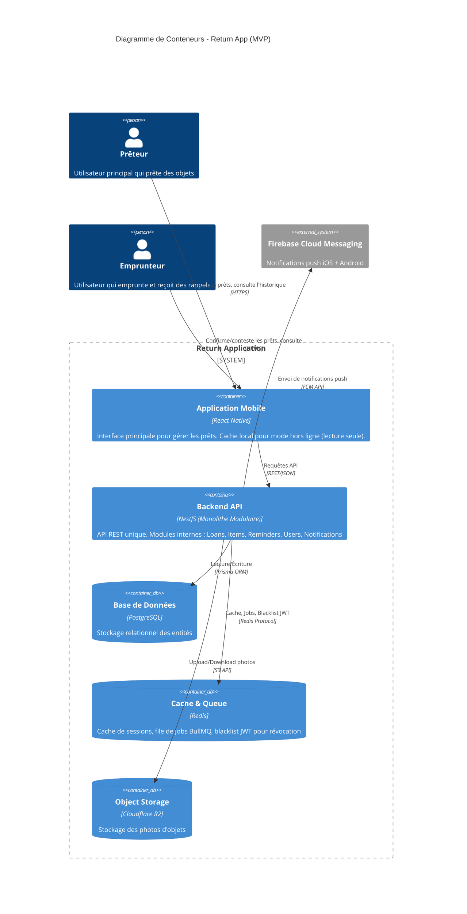
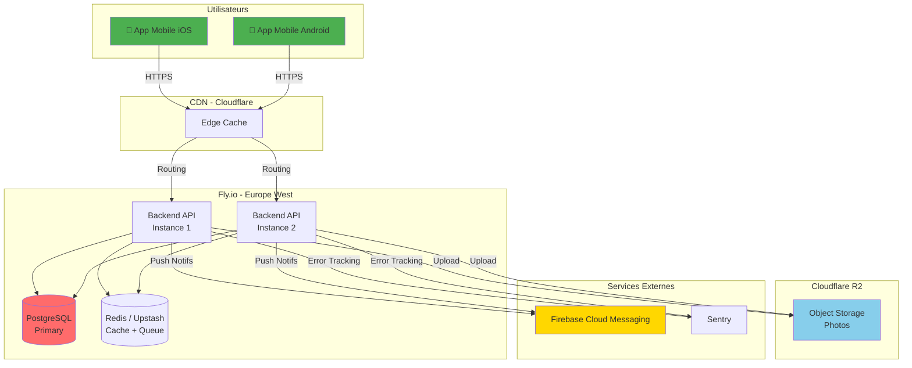

# 01_ARCHITECTURE_TECHNIQUE.md

**Return ↺ - Spécifications Techniques & Décisions d'Architecture**

---

## 1. Architecture de Haut Niveau (High-Level Design)

### Pattern d'Architecture Choisi : **Monolithe Modulaire**

#### Justification Stratégique

Pour un MVP mobile-first avec des exigences de rapidité de développement et une équipe réduite, un monolithe modulaire
est le choix optimal. Voici pourquoi :

**✅ Alignement avec la Vision :**

- **Time-to-market** : Le déploiement rapide est essentiel. Un monolithe permet des itérations plus rapides qu'une
  architecture distribuée.
- **Simplicité opérationnelle** : Un seul déploiement, un seul point de monitoring. Cohérent avec le positionnement "
  outil utilitaire simple".
- **Cohérence des transactions** : Les prêts impliquent plusieurs entités (Objet, Emprunteur, Rappels). Un monolithe
  évite les problèmes de cohérence distribuée.

**✅ Modularité Préservée :**

- Organisation en modules métier (Loans, Items, Reminders, Users, Notifications) permettant une future extraction en
  microservices si nécessaire.
- Isolation des dépendances : chaque module a ses propres interfaces et contrats.

**❌ Microservices rejetés :**

- Over-engineering pour un MVP avec < 10 000 utilisateurs prévus en V1
- Complexité réseau et latence inutiles pour des opérations CRUD simples
- Coût d'infrastructure et de monitoring multiplié

**❌ Serverless rejeté :**

- Cold starts incompatibles avec l'expérience "création de prêt < 30s"
- Moins de contrôle sur les timeouts de notification
- Complexité de debugging accrue pour un MVP

### Diagramme C4 - Niveau Conteneur



---

## 2. Stack Technique Détaillée

### 2.1 Frontend

| Composant          | Technologie                    | Version | Justification                                                                                             |
|--------------------|--------------------------------|---------|-----------------------------------------------------------------------------------------------------------|
| **Framework**      | **React Native**               | 0.78+   | Cross-platform (iOS/Android) avec une seule codebase. New Architecture (Fabric, TurboModules) par défaut. |
| **Gestion d'état** | **Zustand**                    | 5.x     | Plus léger que Redux, API simple. Suffisant pour un MVP sans logique métier complexe côté client.         |
| **Navigation**     | **React Navigation**           | 7.x     | Standard de facto pour React Native. Support du deep linking et meilleur support TypeScript.              |
| **UI Library**     | **React Native Paper**         | 5.x     | Material Design 3 out-of-the-box. Cohérent avec l'UX "simple et utilitaire".                              |
| **Formulaires**    | **React Hook Form**            | 7.x     | Performance optimale, validation native. Crucial pour le formulaire de création de prêt.                  |
| **Caméra**         | **react-native-vision-camera** | 4.x     | Performance supérieure. Wrappers natifs optimisés pour capture photo d'objets.                            |
| **Notifications**  | **@notifee/react-native**      | 9.x     | Gestion avancée des notifications locales et push. Support des actions directes (confirmer/refuser).      |
| **i18n**           | **react-i18next**              | -       | Internationalisation FR/EN. Intégration React Native mature, support du lazy loading des traductions.     |

> **Note :** Les versions indiquées sont celles en vigueur à la date de rédaction (février 2026). Vérifier les dernières
> versions stables au démarrage du développement.

### 2.2 Backend

| Composant            | Technologie                             | Version | Justification                                                                                                |
|----------------------|-----------------------------------------|---------|--------------------------------------------------------------------------------------------------------------|
| **Langage**          | **TypeScript**                          | 5.8+    | Type safety, refactoring sécurisé. Partage des types avec le frontend.                                       |
| **Runtime**          | **Node.js**                             | 22 LTS  | Écosystème mature, excellentes performances I/O. Cohérent avec React Native (même langage full-stack).       |
| **Framework**        | **NestJS**                              | 11.x    | Architecture modulaire native (alignée avec notre monolithe modulaire). DDD-friendly. Dependency injection.  |
| **ORM**              | **Prisma**                              | 6.x+    | Type-safe, migrations automatiques. Génération de clients TypeScript. Utilisé directement dans les services. |
| **Validation**       | **class-validator + class-transformer** | -       | Intégration native NestJS via DTOs et ValidationPipe. Décorateurs TypeScript pour validation déclarative.    |
| **Authentification** | **Passport.js**                         | 0.7+    | Stratégies modulaires (JWT pour V1, OAuth pour V2+).                                                         |
| **File de Jobs**     | **BullMQ**                              | 5.x     | File de jobs robuste basée sur Redis. Gestion des rappels différés et retry.                                 |
| **Logging**          | **Winston**                             | 3.x     | Logs structurés JSON. Intégration avec services de monitoring (Sentry).                                      |

**Accès aux données :** Prisma est utilisé directement dans les services NestJS. Pas de couche Repository Pattern
intermédiaire — cette abstraction est jugée superflue pour le MVP étant donné la stabilité de Prisma et la faible
probabilité de changement d'ORM à court terme.

### 2.3 Base de Données

| Composant                  | Technologie             | Version | Justification                                                                                                                                        |
|----------------------------|-------------------------|---------|------------------------------------------------------------------------------------------------------------------------------------------------------|
| **Base Principale**        | **PostgreSQL**          | 17+     | Relations complexes (Prêts-Objets-Emprunteurs). Support des transactions ACID crucial pour le statut des prêts. Extension pgcrypto pour chiffrement. |
| **Cache**                  | **Redis**               | 8.x     | Cache de sessions, file de jobs (BullMQ), rate limiting, blacklist JWT pour révocation de tokens.                                                    |
| **Object Storage**         | **Cloudflare R2**       | -       | Stockage des photos d'objets. Zéro frais d'egress (optimisation coûts). S3-compatible.                                                               |
| **Full-Text Search (V2+)** | **PostgreSQL tsvector** | -       | Recherche d'objets par nom/description. Suffisant pour MVP avant Elasticsearch.                                                                      |

### 2.4 Infrastructure

| Composant               | Technologie                                       | Justification                                                                       |
|-------------------------|---------------------------------------------------|-------------------------------------------------------------------------------------|
| **Hébergement Backend** | **Fly.io**                                        | Déploiement simple, pricing MVP-friendly. PostgreSQL managed inclus.                |
| **Hébergement Storage** | **Cloudflare R2**                                 | Zéro frais d'egress. S3-compatible. 10 GB gratuits.                                 |
| **CI/CD**               | **GitHub Actions**                                | Intégration native GitHub. Workflows YAML simples. Coût gratuit pour repos publics. |
| **Containerisation**    | **Docker**                                        | Image backend unique. Facilite déploiement et reproductibilité.                     |
| **Monitoring**          | **Sentry** (Erreurs) + **Fly.io Metrics** (Infra) | Sentry gratuit jusqu'à 5k events/mois. Suffisant pour MVP.                          |
| **CDN**                 | **Cloudflare**                                    | Cache des assets statiques. Protection DDoS gratuite.                               |

### 2.5 Services Tiers

| Service                | Provider                           | Usage                                                    |
|------------------------|------------------------------------|----------------------------------------------------------|
| **Notifications Push** | **Firebase Cloud Messaging (FCM)** | Notifications iOS + Android. Gratuit, illimité.          |
| **Emails (V2+)**       | **Resend** / **SendGrid**          | Rappels par email. Resend = 3000 emails/mois gratuits.   |
| **SMS (V2+)**          | **Twilio**                         | Rappels SMS. Pay-as-you-go.                              |
| **Analytics**          | **PostHog** (self-hosted)          | Analytics privacy-first. Alternative à Google Analytics. |

---

## 3. Architecture Decision Records (ADR)

### ADR-001 : Choix de PostgreSQL plutôt que MongoDB

**Contexte :**
Les prêts impliquent des relations strictes entre Objets, Emprunteurs et Rappels. Le statut d'un prêt change via des
transitions d'état complexes (workflow de confirmation). Les requêtes principales sont des jointures (ex: "Tous les
prêts actifs de l'emprunteur X avec leurs objets").

**Décision :**
Utiliser **PostgreSQL** comme base de données principale.

**Conséquences :**

✅ **Avantages :**

- **Intégrité référentielle** : Clés étrangères garantissent qu'un Prêt ne peut exister sans Objet ni Emprunteur.
- **Transactions ACID** : Critique pour les changements de statut (ex: passage de "En attente" à "Actif" + création du
  premier rappel doit être atomique).
- **Requêtes complexes** : Les jointures SQL sont plus performantes et lisibles que les aggregations MongoDB pour nos
  cas d'usage.
- **Extension riche** : pgcrypto pour chiffrement, pg_cron pour jobs planifiés (fallback si Redis échoue).
- **Maturité** : Plus de 30 ans d'existence, documentation exhaustive, support commercial disponible.

❌ **Inconvénients acceptés :**

- **Schéma rigide** : Les migrations nécessitent une stratégie de déploiement (voir section 7).
- **Scalabilité horizontale limitée** : Sharding complexe vs MongoDB. Acceptable pour < 1M d'utilisateurs (horizon 2-3
  ans).
- **Pas de nested documents** : Stocker les métadonnées d'objets (ex: historique de photos) nécessite une table séparée.

**Seuils de vigilance :**
Si le volume dépasse 100k prêts actifs, envisager le partitionnement PostgreSQL. Si la croissance des photos en R2
dépasse 1 TB, envisager Cloudflare Images pour l'optimisation automatique.

---

### ADR-002 : Choix de React Native plutôt que Native (Swift/Kotlin)

**Contexte :**
Le time-to-market est critique. L'équipe doit délivrer une app iOS + Android fonctionnelle rapidement. L'expérience
utilisateur doit être fluide (caméra, notifications en temps réel).

**Décision :**
Développer avec **React Native** (New Architecture activée par défaut) plutôt que des apps natives séparées.

**Conséquences :**

✅ **Avantages :**

- **Codebase unique** : Une équipe, un langage (TypeScript), maintenance divisée par 2.
- **Écosystème mature** : Librairies pour caméra (vision-camera), notifications (@notifee), navigation (
  react-navigation).
- **Hot Reload** : Itérations UX ultra-rapides. Crucial pour tester le flux de création de prêt rapide.
- **Compétences réutilisables** : Les développeurs React peuvent contribuer au mobile.
- **Performance native** : Hermes Engine + architecture Fabric = performance native pour une app CRUD.

❌ **Inconvénients acceptés :**

- **Performance caméra** : Légèrement inférieure au natif pur. Mitigé par react-native-vision-camera qui utilise des
  wrappers natifs optimisés.
- **Taille de l'app** : ~15-20 MB de plus qu'une app native (bundle JS). Acceptable avec une connexion moderne.
- **Dépendance aux mainteneurs** : Si une lib est abandonnée, migration forcée. Risque mitigé en choisissant des libs
  sponsorisées.
- **Limitations OS** : Certaines APIs iOS/Android récentes nécessitent des native modules custom.

**Dette Technique Assumée :**
Si des fonctionnalités ultra-performantes sont nécessaires (ex: AR pour visualiser l'objet dans l'espace), développer
des modules natifs ou migrer des écrans critiques en Swift/Kotlin.

---

### ADR-003 : Choix de NestJS plutôt que Express.js brut

**Contexte :**
Le backend doit être structuré en modules métier (Loans, Reminders, Users). L'architecture impose des boundaries
claires entre contextes. L'équipe doit pouvoir onboarder rapidement de nouveaux développeurs.

**Décision :**
Utiliser **NestJS** comme framework backend plutôt qu'Express.js brut.

**Conséquences :**

✅ **Avantages :**

- **Architecture opinionée** : NestJS impose une structure modulaire (controllers, services). Aligné avec notre
  monolithe modulaire.
- **Dependency Injection native** : Facilite les tests (mocking) et respecte les principes SOLID.
- **TypeScript first-class** : Décorateurs pour validation (class-validator), OpenAPI auto-généré (Swagger), DTOs typés.
- **Écosystème intégré** : Auth (Passport), Queues (Bull), WebSockets out-of-the-box. Moins de temps perdu en
  configuration.
- **Documentation exhaustive** : Onboarding facilité pour nouveaux devs.

❌ **Inconvénients acceptés :**

- **Courbe d'apprentissage** : Plus complexe qu'Express pour les débutants. Nécessite de comprendre les décorateurs et
  l'injection de dépendances.
- **Overhead de performance** : ~5-10% plus lent qu'Express brut à cause des décorateurs. Négligeable pour un MVP (<
  1000 req/s prévues).
- **Taille des bundles** : NestJS embarque plus de dépendances (reflect-metadata, rxjs). Image Docker ~50 MB plus
  lourde.
- **Lock-in partiel** : Migration future vers Fastify ou Hono nécessite réécriture. Mitigé par l'abstraction des
  modules.

**Dette Technique Assumée :**
Si les performances deviennent un bottleneck (> 10k req/s), envisager une réécriture du core en Fastify (compatible
NestJS via adaptateur).

---

### ADR-004 : Choix d'une authentification JWT plutôt que Sessions

**Contexte :**
L'application mobile nécessite une authentification persistante. Les utilisateurs ne doivent pas se reconnecter à chaque
ouverture de l'app. Le backend peut être déployé sur plusieurs instances (scaling horizontal).

**Décision :**
Utiliser **JWT (JSON Web Tokens)** avec refresh tokens et révocation via Redis.

**Conséquences :**

✅ **Avantages :**

- **Stateless** : Pas de stockage de sessions en base. Le backend peut scaler horizontalement sans session stickiness.
- **Mobile-friendly** : JWT stockés en secure storage (Keychain iOS, Keystore Android). Pas de gestion de cookies.
- **Expiration contrôlée** : Access token court (15min) + refresh token long (30 jours). Compromis sécurité/UX.
- **Claims personnalisés** : Le JWT peut contenir le rôle utilisateur (Prêteur/Emprunteur), évitant une requête DB à
  chaque appel.

❌ **Inconvénients acceptés :**

- **Taille des tokens** : JWT > 200 bytes. Envoyé à chaque requête. Acceptable avec HTTP/2 (header compression).
- **Sécurité** : Si le secret JWT est compromis, tous les tokens sont vulnérables. Mitigé par rotation régulière du
  secret (tous les 90 jours).
- **Debugging** : Plus complexe qu'une session lisible en DB. Nécessite des outils (jwt.io).

**Révocation de Tokens (V1) :**
La révocation des tokens est implémentée dès la V1 via une blacklist Redis. Cas d'usage :

- **Changement de mot de passe** : Invalidation immédiate de tous les tokens actifs de l'utilisateur.
- **Déconnexion explicite** : Ajout du token à la blacklist Redis.
- **Compromission suspectée** : Invalidation forcée par l'utilisateur.

Le middleware JWT vérifie la blacklist Redis à chaque requête. L'impact en performance est négligeable (lookup Redis
< 1ms).

---

### ADR-005 : Choix de Fly.io plutôt que AWS/GCP pour le MVP

**Contexte :**
Le MVP doit être déployé rapidement avec un budget limité (≈ 50 €/mois). L'infrastructure doit supporter PostgreSQL +
Redis + un backend NestJS.

**Décision :**
Héberger le backend sur **Fly.io** plutôt que AWS EC2 / Google Cloud Run.

**Conséquences :**

✅ **Avantages :**

- **Simplicité** : Déploiement en 1 commande (`fly deploy`). Pas de gestion de VPC, Load Balancers, etc.
- **Pricing transparent** : Facturation à la seconde. Possibilité de scale-to-zero.
- **Postgres managed** : Haute disponibilité, backups quotidiens, connection pooling inclus.
- **Metrics gratuites** : Dashboards CPU/RAM/requêtes sans coût supplémentaire.

❌ **Inconvénients acceptés :**

- **Moins de services** : Pas de SQS, Lambda, S3 natifs. Nécessite d'utiliser des alternatives (BullMQ au lieu de SQS,
  R2 au lieu de S3).
- **Scaling limité** : Fly.io commence à montrer des limites > 10k req/s. Acceptable pour MVP (< 1k req/s prévues).
- **Lock-in modéré** : Migration vers AWS nécessite réécriture des Dockerfiles et config réseau. Mitigé par Docker.
- **Support communautaire** : Moins de ressources Stack Overflow qu'AWS.

**Estimation des coûts MVP (février 2026) :**

| Composant            | Configuration                 | Coût/mois |
|----------------------|-------------------------------|-----------|
| 2x Backend NestJS    | `shared-cpu-2x` (512 MB) x2   | ~8 €      |
| PostgreSQL (managed) | Plan Basic (1 GB RAM) + 10 GB | ~40 €     |
| Redis (Upstash)      | Pay-as-you-go (~500k req)     | ~2 €      |
| IPv4 dédié           | 1 adresse                     | ~2 €      |
| Trafic sortant       | ~10 GB/mois estimé            | ~1 €      |
| **Total estimé**     |                               | **~53 €** |

> **Note :** Cloudflare R2 (photos) offre 10 GB gratuits + egress gratuit, non compté ci-dessus. Le poste le plus cher
> est PostgreSQL managed. Alternative possible : self-hosted sur une machine Fly.io (~10 €/mois) avec perte de la HA et
> des backups automatiques. Les prix sont à vérifier au démarrage du projet
> sur [fly.io/pricing](https://fly.io/pricing).

**Dette Technique Assumée :**
Préparer une stratégie de migration vers AWS/GCP si le trafic dépasse 100k utilisateurs actifs mensuels (prévu horizon
12-18 mois post-MVP).

---

## 4. Matrice de Sécurité & RBAC (Role-Based Access Control)

### Rôles Définis

| Rôle           | Description                                     | Accès à l'application  |
|----------------|-------------------------------------------------|------------------------|
| **Prêteur**    | Utilisateur authentifié propriétaire de prêts   | App mobile + API       |
| **Emprunteur** | Utilisateur authentifié qui emprunte des objets | App mobile + API       |
| **Système**    | Workers automatiques (rappels, cleanup)         | API interne uniquement |

> **Note :** Un même utilisateur peut être à la fois Prêteur (pour ses prêts) et Emprunteur (pour les prêts des autres).
> Le rôle est contextuel au prêt, pas au compte.

### Ressources Clés

- **Prêts (Loans)** : Entité centrale
- **Objets (Items)** : Attachés aux prêts
- **Rappels (Reminders)** : Notifications planifiées
- **Photos** : Images d'objets stockées
- **Historique** : Archive des prêts terminés
- **Compte Utilisateur** : Données personnelles

### Matrice CRUD (Create / Read / Update / Delete)

| Ressource                       | Prêteur (propriétaire) | Prêteur (autre) | Emprunteur (concerné) | Système |
|---------------------------------|------------------------|-----------------|-----------------------|---------|
| **Prêts - Ses propres prêts**   | C R U D                | -               | R U (statut)          | R U     |
| **Prêts - Prêts d'autres**      | -                      | -               | -                     | R U     |
| **Objets - Ses objets**         | C R U D                | -               | R (via prêt)          | R       |
| **Objets - Objets d'autres**    | -                      | -               | -                     | -       |
| **Rappels - Ses prêts**         | R                      | -               | R                     | C R U D |
| **Photos - Ses objets**         | C R D                  | -               | R                     | R       |
| **Historique - Ses prêts**      | R                      | -               | R (ses emprunts)      | R       |
| **Compte Utilisateur - Soi**    | R U D                  | -               | R U D                 | -       |
| **Compte Utilisateur - Autres** | -                      | -               | -                     | -       |
| **Logs / Métriques**            | -                      | -               | -                     | C       |

### Règles de Sécurité Détaillées

#### 1. Isolation des Données (Niveau Applicatif)

L'isolation des données est assurée **côté application** via les Guards NestJS et le filtrage systématique des requêtes
Prisma par `userId`. Chaque requête vers la base de données inclut un filtre sur l'utilisateur authentifié.

**Principe :** Tout service accédant aux données filtre systématiquement par l'identifiant de l'utilisateur courant
(extrait du JWT). Aucune requête ne retourne de données appartenant à un autre utilisateur sans vérification explicite
de la relation (ex: emprunteur d'un prêt).

```typescript
// Exemple : Un prêteur ne voit que ses propres prêts
const loans = await this.prisma.loan.findMany({
    where: {lenderId: currentUser.id},
});

// Exemple : Un emprunteur ne voit que les prêts le concernant
const borrowedLoans = await this.prisma.loan.findMany({
    where: {borrowerId: currentUser.id},
});
```

#### 2. Validation des Transitions d'État

**Un Emprunteur ne peut modifier que le statut de confirmation, pas supprimer un prêt :**

| Transition                | Prêteur         | Emprunteur      | Règle métier                    |
|---------------------------|-----------------|-----------------|---------------------------------|
| `En attente` → `Actif`    | ✅ (si timeout)  | ✅ (acceptation) | Validation mutuelle             |
| `En attente` → `Contesté` | ❌               | ✅ (refus)       | Emprunteur décide               |
| `Actif` → `Rendu`         | ✅               | ❌               | Seul le Prêteur confirme retour |
| `* ` → `Supprimé`         | ✅ (soft delete) | ❌               | Propriété exclusive             |

#### 3. Rate Limiting par Rôle

| Action                 | Prêteur      | Emprunteur            | Limite                 |
|------------------------|--------------|-----------------------|------------------------|
| Création de prêts      | ✅            | ❌                     | 15 prêts / jour        |
| Upload de photo        | ✅            | ❌                     | 30 photos / jour       |
| Modification de statut | ✅ (son prêt) | ✅ (confirmer/refuser) | 100 requêtes / jour    |
| Login                  | ✅            | ✅                     | 10 tentatives / 15 min |

#### 4. Chiffrement des Données Sensibles

| Donnée                   | État                 | Méthode                                     |
|--------------------------|----------------------|---------------------------------------------|
| Mot de passe             | At rest + in transit | bcrypt (12 rounds) + HTTPS                  |
| Tokens JWT               | In transit           | HTTPS uniquement                            |
| Montants d'argent prêtés | At rest              | Texte clair (pour calculs), accès restreint |
| Photos d'objets          | At rest              | R2 Server-Side Encryption                   |

#### 5. Audit Trail

**Toutes les actions sensibles sont loguées dans une table `audit_logs` immuable :**

| Événement            | Données loguées                       | Rétention |
|----------------------|---------------------------------------|-----------|
| Création de prêt     | Prêteur, Emprunteur, Objet, Timestamp | 5 ans     |
| Changement de statut | Ancien statut, Nouveau statut, Acteur | 5 ans     |
| Suppression de prêt  | Raison, Timestamp                     | Illimité  |

---

## 5. Diagramme de Déploiement



> **Déploiement MVP :** Une seule région (Europe West) avec 2 instances backend pour la redondance. Le multi-régions
> (Europe + USA) sera envisagé en Phase 2 si la base d'utilisateurs le justifie.

---

## 6. Plan de Scalabilité (Post-MVP)

### Seuils de Migration

| Métrique                 | MVP      | Seuil Alerte | Action                                                   |
|--------------------------|----------|--------------|----------------------------------------------------------|
| Utilisateurs actifs/mois | < 10k    | 50k          | Passer à Redis Cluster                                   |
| Prêts actifs             | < 100k   | 500k         | Activer Postgres partitioning                            |
| Photos stockées          | < 100 GB | 1 TB         | Migrer vers Cloudflare Images (optimisation automatique) |
| Requêtes API/s           | < 100    | 1000         | Load balancer + autoscaling                              |
| Coût infrastructure/mois | < 55 €   | 60 €         | Audit et optimisation (caching agressif)                 |

### Stratégie de Scaling

**Phase 1 (0-10k utilisateurs) : MVP actuel**

- 1 région (Europe West), 2 instances backend Fly.io
- PostgreSQL managed Basic (1 GB RAM)
- Redis Upstash (pay-as-you-go)
- Coût : ~53 €/mois

**Phase 2 (10k-100k utilisateurs) : Optimisation verticale**

- 2 régions (Europe + USA), 4 instances backend
- PostgreSQL 4 GB RAM + read replicas
- Redis 2 GB avec persistence
- CDN agressif (cache 24h pour assets statiques)
- Coût : ~200 €/mois

**Phase 3 (100k-1M utilisateurs) : Refonte architecture**

- Migration vers AWS ECS / GCP Cloud Run
- PostgreSQL → Aurora Serverless
- Extraction du module Reminders en service séparé (scaling indépendant)
- Ajout d'Elasticsearch pour recherche full-text
- Coût : ~1500 €/mois

---

## 7. Stratégie de Migration de Base de Données

### Workflow de Migration (Prisma)

Les migrations de schéma sont gérées par Prisma Migrate. Le workflow en production suit ces étapes :

1. **Développement** : `prisma migrate dev` génère le fichier de migration SQL et l'applique sur la base locale.
2. **Review** : Le fichier de migration est commité dans le repo et reviewé en PR comme du code.
3. **CI** : Les tests d'intégration s'exécutent avec la migration appliquée sur une base de test (Testcontainers).
4. **Déploiement** : `prisma migrate deploy` applique les migrations pending sur la base de production.

### Déploiement avec Migration

**Stratégie : Migration avant déploiement (pre-deploy hook)**

```
1. prisma migrate deploy        ← Applique les migrations SQL sur la base de production
2. fly deploy                   ← Déploie la nouvelle version du code
```

Fly.io supporte les `release_command` dans `fly.toml` qui exécutent une commande avant de router le trafic vers la
nouvelle version. La migration est ainsi appliquée avant que le nouveau code ne reçoive des requêtes.

### Règles de Migration

- **Migrations additives uniquement** : Ajouter des colonnes (nullable ou avec défaut), ajouter des tables, ajouter des
  index. Ne jamais supprimer ou renommer une colonne en une seule migration.
- **Migrations destructives en 2 étapes** : (1) Déployer le code qui n'utilise plus la colonne. (2) Migration suivante
  qui supprime la colonne.
- **Rollback** : En cas d'échec, restaurer le backup PostgreSQL le plus récent (voir section 8). Les migrations Prisma
  ne supportent pas nativement le rollback — d'où l'importance des backups avant chaque migration.

---

## 8. Procédure de Backup & Restauration

### Backups Automatiques (Fly.io Managed PostgreSQL)

- **Fréquence** : Snapshots quotidiens automatiques (inclus dans le plan managed).
- **Rétention** : 7 jours de snapshots conservés.
- **Point-in-time recovery** : Disponible via WAL archiving (restauration à n'importe quel point dans les 7 derniers
  jours).

### Procédure de Restauration

En cas de besoin de restauration (migration échouée, corruption de données, erreur humaine) :

1. **Identifier le point de restauration** : Déterminer le timestamp avant l'incident.
2. **Créer une instance de restauration** : `fly postgres create --restore-from <backup-id>` ou restauration
   point-in-time.
3. **Vérifier les données** : Se connecter à l'instance restaurée et valider l'intégrité des données.
4. **Basculer** : Pointer le backend vers la base restaurée.

### Test de Restauration

Un test de restauration doit être effectué pendant le Sprint 0 pour valider que la procédure fonctionne. Ce test sera
répété trimestriellement.

---

## 9. Observabilité (Dette Technique Planifiée)

L'observabilité complète est hors scope du MVP mais les fondations sont posées dès la V1 :

### Implémenté en V1

- **Logging structuré** : Winston en JSON avec `requestId`, `userId`, `timestamp`, `context`, `duration`.
- **Error tracking** : Sentry pour la capture et le reporting des erreurs (frontend + backend).
- **Métriques infra** : Dashboards Fly.io (CPU, RAM, requêtes).
- **Health checks** : Endpoints `/health` et `/ready` pour le monitoring Fly.io et les déploiements.

### Planifié V2+

- **Tracing distribué** : Request-to-response tracing pour diagnostiquer les lenteurs.
- **Alerting** : Alertes configurées sur Sentry (taux d'erreur) et Fly.io (CPU/RAM).
- **Dashboards métier** : Métriques applicatives (prêts créés/jour, rappels envoyés, taux de retour).

---

**Document validé par :** Esdras GBEDOZIN & Ismael AÏHOU
**Date de dernière mise à jour :** 12 février 2026
**Version :** 1.1 — MVP Baseline (post contre-expertise)
